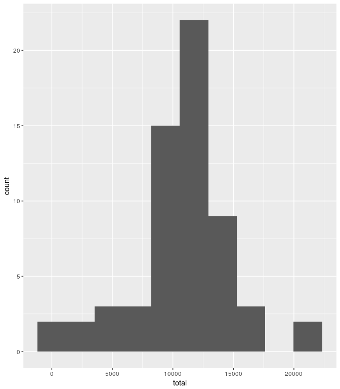

# Reproducible Research: Peer Assessment 1


## Loading and preprocessing the data

We read in the data and add a newdate column so that the dates are in POSIXct.  We will also call all the libraries now.


```r
act <- read.csv("activity.csv")
act$newdate <- as.POSIXct(strptime(act$date, "%Y-%m-%d"))
library(ggplot2)
library(xtable)
library(stats)
library(dplyr)
```

## What is mean total number of steps taken per day?

First, we create a histogram for the daily total.


```r
actsum <- act %>% group_by(date) %>%
        summarize(total = sum(steps))
ggplot(actsum, aes(total)) + 
        geom_histogram(bins = 10, na.rm = T)
```

<!-- -->

We'll now calculate the mean and median.


```r
summact <- actsum %>% 
        summarize(mean = mean(total, na.rm = T), median = median(total, na.rm = T))
acttable <- xtable(summact)
print(acttable, type = "html")
```

<!-- html table generated in R 3.4.0 by xtable 1.8-2 package -->
<!-- Thu Jul 27 17:41:12 2017 -->
<table border=1>
<tr> <th>  </th> <th> mean </th> <th> median </th>  </tr>
  <tr> <td align="right"> 1 </td> <td align="right"> 10766.19 </td> <td align="right"> 10765 </td> </tr>
   </table>


## What is the average daily activity pattern?

We start by plotting the number of steps taken (averaged across all days) per interval.


```r
fiveact <- act %>% group_by(interval) %>%
        summarize(mean = mean(steps, na.rm=T))
ggplot(fiveact, aes(interval, mean)) + geom_line() +
        ylab("average steps taken")
```

<!-- -->

The average number of steps peaks somewhere between intervals 750 and 875.  The following code can find the exact interval for us. 


```r
high <- max(fiveact$mean)
fiveact %>% filter(mean == high) %>% collect %>% .[["interval"]]
```

```
## [1] 835
```


## Imputing missing values

There is a lo of missing data.  Let's count up the number of rows with an NA value.  Then, we'll compare them to the total number of obvservations to see what percentage this actually acounts for.


```r
nas <- sum(is.na(act$steps))
nas
```

```
## [1] 2304
```

```r
nas/nrow(act)*100
```

```
## [1] 13.11475
```


We will now fill in the NA values based on the average number of steps taken for the interval it corresponds to.  Finding the correct average is done by the fillnasteps function.  If a steps value is not NA, our function will just output the steps value.  If steps is NA, the function will output the average number of steps taken for that interval.  

Note that the average was already calculated for the most recent plot so our function will call on that table.  We won't have any ourput here, we'll just store the results from our function in the variable "filled".


```r
fillnasteps <- function(x){
        if(is.na(x[1])){
                mean <- filter(fiveact, interval == x[2])
                mean$mean
        }
        else{x[1]}
}

actna <- act %>% select(steps, interval)
filled <- apply(actna,1,fillnasteps)
```


Now we'll create a new data set, actnew, which will be the same except that the NA values are replaced with their appropriate interval avcerage.


```r
actnew <- act
actnew$steps <- filled
```

Finally, we'll plot the histograms for the daily totals.


```r
actnewtotal <- actnew %>% group_by(date) %>%
        summarize(total = sum(steps))
ggplot(actnewtotal, aes(total)) + 
        geom_histogram(bins = 10)
```

<!-- -->

```r
summactnew <- actnewtotal %>% 
        summarize(mean = mean(total), median = median(total))
acttablenew <- xtable(summactnew)
print(acttablenew, type = "html")
```

<!-- html table generated in R 3.4.0 by xtable 1.8-2 package -->
<!-- Thu Jul 27 17:33:34 2017 -->
<table border=1>
<tr> <th>  </th> <th> mean </th> <th> median </th>  </tr>
  <tr> <td align="right"> 1 </td> <td align="right"> 10766.19 </td> <td align="right"> 10766.19 </td> </tr>
   </table>

<br>

Notes:  

* The means are exactly the same as before.  This makes sense because I replaced NA values with some calculated means.
* The medians differ so slightly.  There were some days with no input values so all values for that day end up coming out the same which is why our median is no longer an integer (or average of two integers).
* As mentioned in the previous bullet, the days with all NA values have all the same totals now.  Hence our histograms look quite different with a much taller bin where those days are now located.


## Are there differences in activity patterns between weekdays and weekends?

First we must classify the weekedns and weekdays in our dates. This will be done by creating a function that determes if a day is on the weekend or not.  If it is, "Weekend" will be the output.  If not, then it is "Weekday".  We'll then loop this through our "newdate" column to create a vector "Day" which will then be added to our table.


```r
wkends <- c("Sat", "Sun")

wkdayend <- function(x){
        if(weekdays(x, abbreviate = T) %in% wkends){
                "Weekend"
        }
        else{"Weekday"}
}
Day <- sapply(actnew$newdate, wkdayend)
actnew$Day <- as.factor(Day)
```


```r
fiveactnew <- actnew %>% group_by(interval, Day) %>%
        summarize(mean = mean(steps))
ggplot(fiveactnew, aes(interval, mean)) + geom_line() +
        ylab("average steps taken") +
        facet_grid(Day ~ .)
```

<!-- -->
